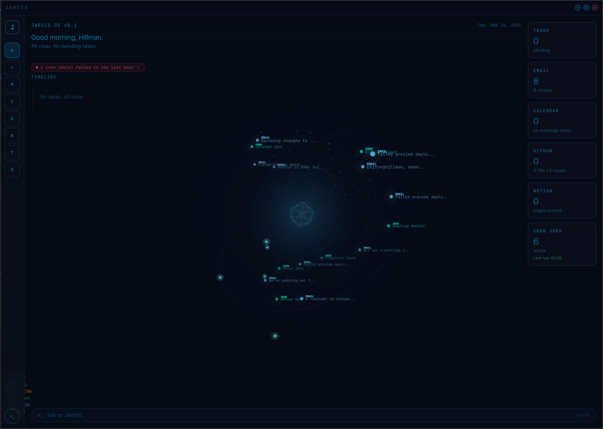

# JARVIS -- Personal AI Assistant

A macOS desktop AI assistant inspired by Iron Man's JARVIS. Holographic dark UI, real-time voice I/O, multi-service integrations, and an interactive 3D data sphere -- all running natively as a single binary.

Built with **Tauri v2** (Rust) + **React** + **TypeScript**. No Electron. No web server. Just Rust and a webview.

[Features](#features) | [Tech Stack](#tech-stack) | [Getting Started](#getting-started) | [Architecture](#architecture) | [How It Was Built](#how-it-was-built)

---

> **This project is under active development.** Found a bug or have a suggestion? [Open an issue](https://github.com/ChiFungHillmanChan/jarvis-ai-assistant/issues) -- all feedback is welcome.

---

## What It Does

JARVIS sits on your desktop and connects to your email, calendar, notes, and code. It syncs everything in the background, surfaces what matters through an AI-curated timeline, and lets you interact via chat or voice. You can ask it to open apps, run shell commands, create tasks, search your Notion, check your GitHub PRs -- and it executes the actions directly on your machine.

---

## Screenshot



*Dashboard view: 3D data sphere with live email/cron/calendar nodes, sidebar navigation, AI-curated timeline, and real-time stats panel. Full holographic theme with cyan glow accents.*

---

## Features

### Interactive 3D Data Sphere

A real-time holographic sphere rendered entirely with **Canvas2D** (no Three.js, no WebGL). It visualizes your actual data as color-coded nodes orbiting a glowing core:

- **Cyan** nodes = tasks
- **Light blue** nodes = emails
- **Amber** nodes = calendar events
- **Green** nodes = GitHub items
- **Purple** nodes = Notion pages
- **Teal** nodes = cron jobs

The sphere supports mouse-drag rotation, click-to-zoom on individual nodes, and idle auto-rotation. Energy arcs animate between connected nodes. Voice activity modulates the ring speed and color intensity in real time. Data refreshes every 10 seconds without resetting node positions.

### AI Chat with Tool Execution

- **Cmd+K** opens a floating chat panel (never blocks the main view)
- Dual-model architecture: Claude (primary) with OpenAI fallback
- Streaming responses with real-time token display
- **18 native tools** the AI can call: open apps, run commands, manage files, create tasks, search email, compose messages, query calendar, control system volume/brightness, manage windows, read/write clipboard, take screenshots, send notifications, and more
- Claude uses native tool calling; OpenAI uses function calling -- both resolve multi-step actions in a loop before responding
- Conversation history persisted in local SQLite

### Voice I/O

- **Cmd+Shift+J** for push-to-talk
- Speech-to-text via OpenAI Whisper API (cloud) with local Whisper model fallback (offline-capable)
- Text-to-speech via macOS `say` command with configurable voice, rate, and volume
- Visual indicator overlay: cyan (listening), amber (processing), green (speaking)
- Mic amplitude drives the 3D sphere ring animations

### Integrations

| Service | What JARVIS Does | Sync |
|---------|-----------------|------|
| **Gmail** | Inbox sync, email summaries, smart archive with learning | Every 5 min |
| **Google Calendar** | Event sync (7-day horizon), meeting prep alerts | Every 5 min |
| **Notion** | Page search, content snippets, create new pages | Every 10 min |
| **GitHub** | Assigned issues, PRs for review, CI status | Every 10 min |
| **Obsidian** | Vault search, read/write notes via Local REST API | On demand |

### Smart Assistant

- **Morning briefing** generated on launch using aggregated context (tasks, calendar, email, GitHub)
- **Email learning** tracks your archive patterns -- after 3 archives from the same sender, suggests an auto-archive rule
- **Context builder** gathers pending/overdue tasks, urgent deadlines, unread counts, and open PRs into a single structured snapshot for the AI
- **Action parser** intercepts AI responses and executes embedded commands (create task, open app, set reminder, etc.)

### Automation Engine

- **7 built-in cron jobs**: email sync, calendar sync, deadline monitor (daily 9 AM), Notion sync, GitHub digest, email auto-archive, proactive alerts
- **Custom cron jobs**: describe what you want in natural language (e.g., "every Monday at 9am check for spam emails") and the AI generates the cron schedule
- Full execution history with status tracking (running/completed/failed)
- Cron dashboard with timeline view and job management

### System Control

The AI can execute these directly on your Mac:

- Open applications and URLs
- Run shell commands (with safety blocklist -- blocks `rm`, `sudo`, `mkfs`, etc.)
- Search files via Spotlight (`mdfind`)
- Read/write clipboard
- Manage windows (list, focus, resize, move)
- Control volume, brightness, dark mode
- Send native macOS notifications
- Take screenshots (fullscreen, selection, or window)

### Pages

| Page | Purpose |
|------|---------|
| **Dashboard** | 3-column layout: sidebar, AI timeline, live stats panel |
| **Email** | Inbox with filters, archive/delete, conversation threads |
| **Calendar** | Event list with day/week/month views |
| **GitHub** | Issues, PRs, CI status organized by repo |
| **Notion** | Page browser, search, preview, create new pages |
| **Cron** | Job list, execution timeline, custom job creator |
| **Settings** | API keys, OAuth, AI provider, voice config, TTS settings |

---

## Tech Stack

| Layer | Technology | Why |
|-------|-----------|-----|
| **Desktop framework** | [Tauri v2](https://v2.tauri.app/) | Native binary, ~10MB, Rust backend with webview frontend. No Electron bloat. |
| **Backend** | Rust | Memory-safe, fast, async (tokio). Handles all API calls, auth, scheduling, voice, and system control. |
| **Frontend** | React 18 + TypeScript + Vite | Minimal deps -- no UI library, no state management library. Just React hooks and custom CSS. |
| **3D rendering** | Canvas2D | Custom math for 3D projection, rotation matrices, z-sorting. No Three.js or WebGL needed. |
| **Database** | SQLite via rusqlite + refinery | Local-first. 11 tables, 6 migrations, runs on startup. All data on your machine. |
| **AI (primary)** | Claude API | Streaming SSE, native tool calling, up to 5 multi-step iterations per request. |
| **AI (fallback)** | OpenAI API (GPT) | Same 18 tools via function calling. Automatic fallback if Claude errors. |
| **Voice STT** | OpenAI Whisper API + local whisper-rs | Cloud primary, offline fallback with downloadable tiny/base models. |
| **Voice TTS** | macOS `say` | Zero-dependency TTS with voice/rate/volume control. |
| **Audio capture** | cpal 0.17 | Cross-platform audio device access, 16kHz sampling for Whisper compatibility. |
| **Auth** | OAuth2 PKCE | Google sign-in for Gmail + Calendar. Tokens stored in SQLite, auto-refresh. |
| **Scheduling** | tokio-cron-scheduler | Background cron jobs on the tokio async runtime, persisted across restarts. |
| **IPC** | Tauri invoke | Frontend calls Rust via `invoke("command", {args})`. 40+ registered commands. |

### Why These Choices

**Tauri over Electron:** JARVIS ships as a ~10MB native binary instead of a ~200MB Electron app. The Rust backend handles CPU-intensive work (audio processing, local Whisper inference, concurrent API calls) without blocking the UI. Tauri v2's `#[tauri::command]` macro makes IPC between React and Rust feel like calling a local function.

**Canvas2D over Three.js/WebGL:** The 3D data sphere uses basic trigonometry and projection math. Canvas2D is simpler to debug, has no dependency overhead, and performs well for a particle system of this scale. The entire 3D scene is one React component with a single `<canvas>` element.

**No UI library:** The holographic theme is custom CSS -- glassmorphism panels, cyan glow effects, JetBrains Mono typography. Adding a component library would fight the design rather than help it. Total frontend dependencies: React, React DOM, and the Tauri API bindings. That's it.

**SQLite over a cloud database:** Everything stays on your machine. JARVIS is a personal assistant, not a SaaS product. The external services (Gmail, Calendar, Notion, GitHub) remain the source of truth; SQLite is a local cache that enables offline access and fast queries.

---

## Architecture

```
+--------------------------------------------------+
|                    macOS App                       |
|                                                    |
|  +--------------------+  +---------------------+  |
|  |   React Frontend   |  |    Rust Backend      |  |
|  |                    |  |                       |  |
|  |  3D Data Sphere    |  |  AI Router            |  |
|  |  Chat Panel        |  |    Claude + OpenAI    |  |
|  |  Dashboard         |  |    18 callable tools  |  |
|  |  Pages (7)         |  |                       |  |
|  |  Voice Indicator   |  |  Integrations         |  |
|  |                    |  |    Gmail, Calendar    |  |
|  |  Hooks             |  |    Notion, GitHub     |  |
|  |    useChat         |  |    Obsidian           |  |
|  |    useVoiceState   |  |                       |  |
|  |    useKeyboard     |  |  Voice Engine         |  |
|  |                    |  |    Whisper STT        |  |
|  +--------+-----------+  |    macOS TTS          |  |
|           |              |    Audio Capture       |  |
|     Tauri invoke()       |                       |  |
|           |              |  Scheduler             |  |
|           +--------------+    7 cron jobs         |  |
|                          |                       |  |
|                          |  System Control        |  |
|                          |    Apps, URLs, shell   |  |
|                          |    Files, clipboard    |  |
|                          |    Windows, volume     |  |
|                          |                       |  |
|                          |  SQLite (11 tables)    |  |
|                          +---------------------+  |
+--------------------------------------------------+
```

### Project Structure

```
src/                              # React frontend
├── components/
│   ├── 3d/                       # Canvas2D holographic sphere (JarvisScene.tsx)
│   ├── chat/                     # Message renderer, inline charts, status cards
│   ├── cron/                     # Cron job cards, timeline, creation flow
│   ├── ChatPanel.tsx             # Cmd+K floating chat
│   ├── Sidebar.tsx               # Navigation
│   ├── VoiceIndicator.tsx        # Voice state overlay
│   └── ...                       # Dashboard cards, stats, timeline
├── hooks/
│   ├── useChat.ts                # Chat state, message history, streaming
│   ├── useVoiceState.ts          # Voice engine state machine
│   ├── useKeyboard.ts            # Global keyboard shortcuts
│   ├── useTauriCommand.ts        # Generic Tauri invoke wrapper
│   └── ChatContext.tsx           # Shared chat context provider
├── lib/
│   ├── types.ts                  # Shared TypeScript interfaces
│   └── commands.ts               # Typed Tauri invoke wrappers (40+)
├── pages/                        # Dashboard, Email, Calendar, GitHub, Notion, Cron, Settings
└── styles/
    ├── global.css                # Holographic theme (CSS variables, glassmorphism)
    └── animations.css            # Keyframe animations

src-tauri/                        # Rust backend
├── src/
│   ├── ai/
│   │   ├── claude.rs             # Claude API client (streaming, tool calling)
│   │   ├── openai.rs             # OpenAI API client (streaming, function calling)
│   │   └── tools.rs              # 18 shared tool definitions
│   ├── assistant/
│   │   ├── context.rs            # DayContext: aggregates tasks, events, emails, PRs
│   │   ├── briefing.rs           # AI-generated morning briefing
│   │   └── actions.rs            # Action tag parser for Claude responses
│   ├── auth/
│   │   └── google.rs             # OAuth2 PKCE flow with auto-refresh
│   ├── commands/                 # 40+ Tauri IPC command handlers
│   │   ├── chat.rs               # AI chat with streaming + tool execution
│   │   ├── assistant.rs          # Briefing, context, proactive checks
│   │   ├── email.rs              # Gmail operations
│   │   ├── calendar.rs           # Calendar operations
│   │   ├── github.rs             # GitHub operations
│   │   ├── notion.rs             # Notion operations
│   │   ├── obsidian.rs           # Obsidian vault operations
│   │   ├── cron.rs               # Cron job management
│   │   ├── system.rs             # System control commands
│   │   ├── tasks.rs              # Task CRUD
│   │   ├── settings.rs           # User preferences
│   │   ├── dashboard.rs          # Dashboard data aggregation
│   │   └── google_auth.rs        # OAuth flow commands
│   ├── integrations/
│   │   ├── gmail.rs              # Gmail API client
│   │   ├── calendar.rs           # Google Calendar API client
│   │   ├── notion.rs             # Notion API client
│   │   ├── github.rs             # GitHub API client
│   │   └── obsidian.rs           # Obsidian Local REST API client
│   ├── scheduler/
│   │   ├── mod.rs                # tokio-cron-scheduler setup
│   │   └── jobs.rs               # 7 job type implementations
│   ├── system/
│   │   └── control.rs            # macOS system control (apps, files, windows, volume, etc.)
│   ├── voice/
│   │   ├── audio_router.rs       # Audio device management
│   │   ├── transcribe.rs         # Whisper STT (cloud + local)
│   │   ├── tts.rs                # macOS say TTS
│   │   ├── wake_word.rs          # Wake word detection
│   │   └── model_manager.rs      # Whisper model downloads
│   ├── db.rs                     # SQLite init + refinery migrations
│   ├── tray.rs                   # System tray menu
│   └── lib.rs                    # App initialization, state management, command registration
└── migrations/                   # V1-V6 SQL schema files
```

### Database Schema

11 tables in local SQLite (`~/Library/Application Support/jarvis/jarvis.db`):

| Table | Purpose |
|-------|---------|
| `user_preferences` | Key-value store: AI provider, API keys, voice settings, theme |
| `tasks` | Tasks with title, deadline, priority (0-3), status, source |
| `conversations` | Chat history (role + content + timestamp) |
| `emails` | Cached Gmail messages with importance scoring |
| `calendar_events` | Cached Google Calendar events |
| `cron_jobs` | Scheduled jobs with cron expression and action type |
| `cron_runs` | Execution history per job (status, duration, errors) |
| `notion_pages` | Cached Notion pages with content snippets |
| `github_items` | Issues, PRs, and CI status by repo |
| `email_rules` | Learned archive patterns per sender |

Migrations run automatically on startup via refinery.

---

## Getting Started

### Prerequisites

- **macOS** (uses native APIs: `say`, `mdfind`, `open`, accessibility)
- [Rust](https://rustup.rs/) 1.70+
- [Node.js](https://nodejs.org/) 18+
- [cmake](https://cmake.org/) -- `brew install cmake` (required for whisper-rs)

### Install

```bash
git clone https://github.com/ChiFungHillmanChan/jarvis-ai-assistant.git
cd jarvis-ai-assistant
npm install
```

### Configure

```bash
cp .env.example .env
```

Add your API keys:

```env
ANTHROPIC_API_KEY=sk-ant-...    # Claude API (primary AI)
OPENAI_API_KEY=sk-...            # OpenAI (fallback AI + Whisper STT)
GOOGLE_CLIENT_ID=...             # Gmail + Calendar OAuth (optional)
GOOGLE_CLIENT_SECRET=...         # Gmail + Calendar OAuth (optional)
```

Notion, GitHub, and Obsidian tokens are configured in the app's Settings page and stored in the local database.

### Google OAuth Setup (for Gmail + Calendar)

1. Go to [Google Cloud Console](https://console.cloud.google.com)
2. Create a project, enable **Gmail API** and **Google Calendar API**
3. Configure OAuth consent screen (add scopes: `gmail.readonly`, `gmail.modify`, `calendar`)
4. Create OAuth credentials (Desktop app type)
5. Add your email as a test user
6. Put Client ID and Secret in `.env`

### Run

```bash
npm run tauri dev
```

First build compiles ~530 Rust crates. Subsequent builds are incremental and fast.

---

## Keyboard Shortcuts

| Action | Shortcut |
|--------|----------|
| Open chat | **Cmd+K** |
| Close chat / cancel | **Esc** |
| Push-to-talk | **Cmd+Shift+J** |

---

## Design

Full holographic theme built with pure CSS -- no UI component library.

- **Background:** #060a14 (near-black with blue undertone)
- **Accent:** rgba(0, 180, 255) (glowing cyan) at varying opacities
- **Panels:** Glassmorphism with backdrop-filter blur, translucent backgrounds, cyan border glow on hover
- **Typography:** JetBrains Mono for system labels and monospace elements, Inter/system sans-serif for body text
- **Data colors:** Cyan (tasks), light blue (email), amber (calendar), green (GitHub), purple (Notion), teal (cron)
- **No emojis** -- text and geometric elements only

---

## Local Whisper Model (Optional)

JARVIS uses the OpenAI Whisper API for speech-to-text by default. For offline fallback, download a local model:

```bash
mkdir -p ~/Library/Application\ Support/jarvis/models
curl -L https://huggingface.co/ggerganov/whisper.cpp/resolve/main/ggml-base.bin \
  -o ~/Library/Application\ Support/jarvis/models/ggml-base.bin
```

The app will automatically use the local model when the cloud API is unavailable.

---

## Development

### Build Commands

| Command | Purpose |
|---------|---------|
| `npm run tauri dev` | Full app (Vite + Rust backend) |
| `npm run dev` | Frontend-only dev server (port 1420) |
| `npm run build` | TypeScript check + Vite production build |
| `npm run tauri build` | Desktop release build |
| `cargo test --manifest-path src-tauri/Cargo.toml` | Run Rust tests |
| `cargo fmt --all --check --manifest-path src-tauri/Cargo.toml` | Rust format check |

### Coding Style

- **TypeScript:** Strict mode, ES modules, double quotes, 2-space indent. React components in `PascalCase`, hooks as `useSomething`, helpers in `camelCase`.
- **Rust:** Standard conventions -- 4-space indent, `snake_case` modules/functions, small focused modules.
- **Tauri commands:** Wrappers centralized in `src/lib/commands.ts`, types in `src/lib/types.ts`.

### Commits

Follow Conventional Commits: `feat(scope): message`, `fix(scope): message`, `refactor:`, etc. Use imperative, scoped summaries.

### Testing

No frontend test runner yet -- `npm run build` is the minimum validation for UI changes. For interactive work, verify in `npm run tauri dev`. Add Rust unit tests for non-trivial backend behavior.

---

## How It Was Built

This project was built iteratively with [Claude Code](https://claude.ai/code) as the primary development tool. The workflow:

1. **Design specs first** -- detailed markdown specs covering architecture, UI, data flow, and component breakdowns before writing any code
2. **Tauri v2 scaffold** -- `npm create tauri-app` with React + TypeScript template
3. **Rust backend modules** -- built one integration at a time (database, then Gmail, Calendar, Notion, GitHub), each with its own Tauri commands
4. **AI layer** -- Claude API client with streaming SSE, then OpenAI as fallback, then shared tool definitions for both
5. **Voice pipeline** -- audio capture with cpal, cloud Whisper transcription, then local Whisper fallback, then macOS TTS
6. **3D sphere** -- started with particles, added data binding, projection math, interaction, and voice-reactive animation
7. **Smart features** -- context aggregation, morning briefing, email learning, action execution
8. **Scheduler** -- cron jobs seeded on first run, custom job creation via natural language

Key tools and resources:
- **[Tauri v2](https://v2.tauri.app/)** -- the desktop framework that makes this possible. Rust backend + webview frontend, native binary output.
- **[Claude Code](https://claude.ai/code)** -- AI-assisted development for both Rust and TypeScript. Used for architecture decisions, implementation, and debugging.
- **[Anthropic Claude API](https://docs.anthropic.com/)** -- primary AI provider with tool/function calling support
- **[OpenAI API](https://platform.openai.com/)** -- fallback AI + Whisper for speech-to-text
- **[rusqlite](https://github.com/rusqlite/rusqlite)** -- SQLite bindings for Rust
- **[tokio-cron-scheduler](https://github.com/mvniekerk/tokio-cron-scheduler)** -- background job scheduling
- **[cpal](https://github.com/RustAudio/cpal)** -- cross-platform audio capture
- **[whisper-rs](https://github.com/tazz4843/whisper-rs)** -- local Whisper model inference in Rust

---

## License

MIT
